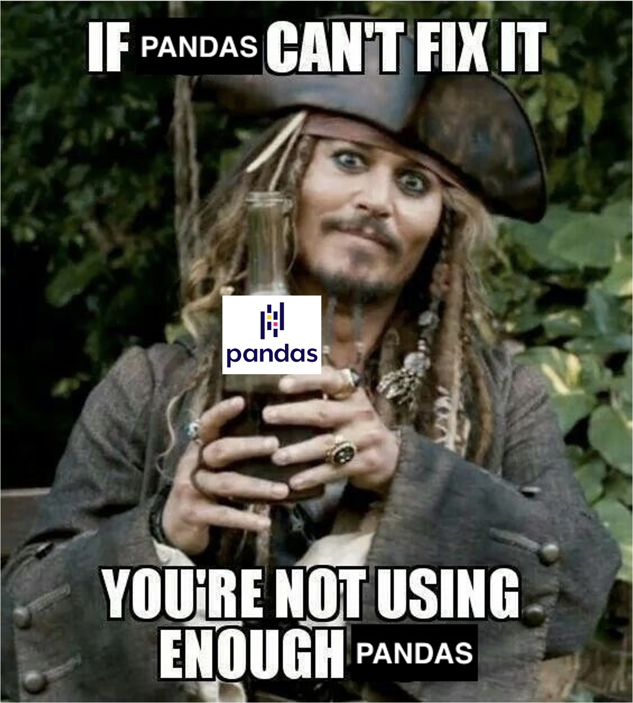

# Pirates of Monterey: An Analysis on Trends of Piracy in Major Shipping Lanes
- Group Members: Deryk Clary, MaryGrace Burke, Julia MacDonald, Mike Galvan.
- OA3801 Computational Methods for Operations Research II Final Project

## Contents
* [File/Folder Overview](#File/Folder-Overview)
* [Background](#Background)
* [Data Sources](#Data-Sources)
* [Data Curation and Computation](#Data-Curation-and-Computation)
* [Analysis](#Analysis)
* [Lessons Learned](#Lessons-Learned)
* [Future Work](#Future-Work)

## File/Folder Overview
- [Data_Files](https://github.com/deryk96/pirates-of-monterey/tree/main/Data_Files): All data files we used as inputs to the project.
    - [Data_Sources.txt](https://github.com/deryk96/pirates-of-monterey/blob/main/Data_Files/Data_Sources.txt): Links to all sources of data.
    - [Model_Output.csv](https://github.com/deryk96/pirates-of-monterey/blob/main/Data_Files/Model_Output.csv): IMO Dataset after being put through Natural Language Processing (NLP) Model and labels assigned to each incident details string.
    - [[Clean] IMO Piracy - 2000 to 2022.csv](https://github.com/deryk96/pirates-of-monterey/blob/main/Data_Files/%5BClean%5D%20IMO%20Piracy%20-%202000%20to%202022%20(PDV%2001-2023).csv): Clean data set pulled from data.world.
    - [[Dirty] ListOfIncidents_IMO.csv](https://github.com/deryk96/pirates-of-monterey/blob/main/Data_Files/%5BDirty%5D_ListOfIncidents_IMO.csv): Uncleaned data pulled straight from the IMO Website.
    - [cocom_countries.csv](https://github.com/deryk96/pirates-of-monterey/blob/main/Data_Files/cocom_countries.csv): Data set with countries and their associated Combatant Command.
    - [imo-vessel-codes.csv](https://github.com/deryk96/pirates-of-monterey/blob/main/Data_Files/imo-vessel-codes.csv): Vessel names and their associated IMO numbers.
    - [training_data.csv](https://github.com/deryk96/pirates-of-monterey/blob/main/Data_Files/training_data.csv): Self-labelled training data fed into the spaCy model to train it.
- [Deprecated](https://github.com/deryk96/pirates-of-monterey/tree/main/Deprecated): Old files that are not used, but kept for future reference.
- [Map_Files](https://github.com/deryk96/pirates-of-monterey/tree/main/Map_Files): Folder with maps and shp files used for analysis.
- [Product_Files](https://github.com/deryk96/pirates-of-monterey/tree/main/Product_Files): Folder with PowerPoints and papers made for presenting this project.
- [Results](https://github.com/deryk96/pirates-of-monterey/tree/main/Results): Folder with Bokeh html tiles and output datasets
- [Spacy_Files](https://github.com/deryk96/pirates-of-monterey/tree/main/Spacy_Files): Folder with the final spaCy model, config files for training, and the training, development, and testing data used to train and evaluate the model.
- [1_nlp_creation_testing.ipynb](https://github.com/deryk96/pirates-of-monterey/blob/main/1_nlp_creation_testing.ipynb): Jupyter notebook containing all the code to train and test our spaCy model.
- [2_data_analysis_testing.ipynb](https://github.com/deryk96/pirates-of-monterey/blob/main/2_data_analysis_plotting.ipynb): Jupyter notebook containing the code to develop our Bokeh plots and graphs used to conduct analysis.
- [3_wave_height_analysis.py](https://github.com/deryk96/pirates-of-monterey/blob/main/3_wave_height_analysis.py): Script to add wave heights to each piracy incident.
- [3_wave_height_analysis_nb.ipynb](https://github.com/deryk96/pirates-of-monterey/blob/main/3_wave_height_analysis_nb.ipynb): Same as previous but in Jupyter Notebook form.
- [spacy_functions.py](https://github.com/deryk96/pirates-of-monterey/blob/main/spacy_functions.py): Some dependent functions for our NLP Creation notebook.

## Background
The resurgence of piracy activities in vital shipping lanes poses a significant threat to maritime traffic, necessitating an initiative-taking approach to mitigate risks and ensure the safety of vessels, cargo, and crew.  Our project's main goal was to discern patterns and correlations within piracy incidents to aid in the formulation of proactive measures for mitigating piracy risks.  By examining a ship's profile, including its location, country of affiliation, and type of vessel, we aimed to identify indicators that increase  the probability a vessel is targeted for piracy. Stakeholders such as coastal authorities, shipping companies, and naval operations stand to benefit from actionable insights derived from this analysis, facilitating the protection of maritime interests and safe navigation across high-risk regions.

## Data Sources
- IMO Piracy Data:  The primary data set was sourced from the International Maritime Organization website (https://gisis.imo.org/Public/PAR/Reports.aspx), which provides information on piracy incidents in a CSV file format.  The CSV file contained 8,556rows, 16 columns, and approximately 19,000 missing or null values.  Each row in the data set represented information from piracy incidents between 1994 and 2024.  The information about each incident included: incident date, ship name, ship type, IMO number, area, location, incident details, consequences to the crew, action taken by the crew, and reporting information.  Much of the data was presented in natural language (sentences and paragraphs), necessitating further extrapolation of data and data cleaning.  The data frame created from this data set will be referred to as the “dirty data frame.”
- Data.World Piracy Data:  The alternative data set was sourced from data.world (https://data.world/project-data-viz/imo-piracy-2000-to-2022-pdv-01-2023) and is a cleaned subset of the IMO piracy data set in a CSV file format.  The CSV file contained 4,814 rows and 16 columns and had far less missing or null values than the dirty data frame.  Like the IMO piracy data, each row in this data set represented information from piracy incidents, however this data set only had incidents that took place between 2000 and 2022.  The information about each incident included: incident data, ship name, ship flag, ship type, area, location, consequences to the crew, part of the ship raided, ship status, weapons used, crew injuries, crew hostages, crew missing, crew deaths, and crew assaults.  The data was in a format easy to immediately begin analysis on the data.  The data frame created from this data set will be referred to as the “clean data frame.”
- IMO Vessel Codes:  The dataset was retrieved from GitHub (https://github.com/warrantgroup/IMO-Vessel-Codes/tree/master) in CSV format, and associates IMO vessel codes with a ISO2 codes.  (Note: We attempted to obtain this information through web scraping vesselfinder.com, but we were unable to access all the sites required without paying for access.)
- COCOM Countries: The dataset was taken from OA3801 Lab 3, and associates ISO2 codes with their respective countries.

## Data Curation and Computation
The curation process was a multi-step process.  We first used Natural Language Processing (NLP) models, found in the Python package named spaCy, to extrapolate information from the strings in the dirty IMO data set.  From these strings, we sought to determine whether a ship was boarded, whether it was hijacked, and the consequences to the crew (hostages or assaults).  To extract the desired data from the strings, we began by using spaCy’s token-based matching to establish a rule-based model.  The model was tested on training data (a portion of the data that we manually labeled as boarded, hijacked, etc.) and refined based on the results of the test.  The extraction of “boarded” labels necessitated 17 rules, while “hijacked” labels only required two.  When rule-based matching was tested on the full dataset, it did not perform well.  There were far too many false positive “boarded” labels to accept it as the solution. In the end, the superior solution we found was to train a custom Span Categorizing NLP Model to find and categorize portions of each sentence in the data set with the applicable labels. The model training took 1 hour and 11 minutes for the loop to iterate through training data and develop an accurate statistical model to correctly identify the labels.  Once applied to the full dataset of 8,556 strings, the model took 4.5 minutes to process and label each incident.  Subsequently, we merged the data from the IMO Vessel Codes dataset and COCOM Countries dataset to extrapolate a country (ship flag) for each ship.  Finally, the latitude and longitude were converted into a usable format using regular expressions (REGEX) and a function to convert from degrees/minutes/seconds to decimal.  We opted to drop any incidents that had null or missing values for latitude and longitude, as we considered this a crucial parameter for analysis.

## Analysis
Our initial step was to visually scrutinize the data from each data frame (dirty and clean), employing tools such as Folium maps, MatPlotLib, Bokeh, Streamlit, and Seaborn plots to represent the data.  This visual representation facilitated our decision-making process regarding the factors we wished to delve deeper into.  Observing a high concentration of incidents in specific locations, we decided to concentrate our analysis on three regions with the highest incident density: the Strait of Malacca, Gulf of Aden, and Gulf of Guinea.  To segregate the data into these three categories, we defined latitude and longitude boundaries for each region of interest and applied them to both data frames, thereby partitioning the data based on geographical location.  Our aim was to investigate whether the incidents in these areas exhibited higher severity levels, leading us to classify each incident into one of four categories:
-	Unsuccessful Attempt (green): Pirates attempted to board but were unsuccessful.
-	Low (yellow): Pirates managed to board, but there were no instances of hostages being taken, crew assaults, crew injuries, or crew fatalities.
-	Medium (red): Pirates boarded or hijacked the ship, crew members were assaulted or injured, but there were no crew fatalities.
-	High (black): Pirates boarded or hijacked the ship, and crew members were either killed, taken hostage, or went missing.
     Following this, we analyzed the two data frames in two distinct manners.  We performed an analysis on the clean data frame to generate analytical content that would guide further research into underlying trends.  Simultaneously, we conducted a comparative analysis of the dirty and clean data frames to assess the efficacy of our data curation process.
     - Clean Data Analysis:  Using the clean data frame, our analysis focused on the following aspects within each region of interest: the correlation between ship flags and incident severity levels, the types of weapons used and their associated consequences to the crew, and the category of vessels and the associated consequences to the crew.  Through visual analysis, we determined that the ship flags that most frequently involved in piracy incidents across the three regions of interest are those of Liberia, Panama, and Singapore.  Furthermore, we deduced that the use of firearms was most common in the Gulf of Guinea, while knives were the weapon of choice in the Strait of Malacca.  Among the types of vessels, tankers followed by cargo ships recorded the highest number of incidents across our regions of interest, with the Strait of Malacca witnessing the highest level of violence.
     - Comparative Analysis:  By conducting a visual, comparative analysis of the dirty and clean data frames, we sought to evaluate the effectiveness of our data curation process.  While patterns in incident frequency, geographical distribution, and country affiliation remained consistent with the clean data frame analysis, discrepancies in severity labeling highlighted the significance of thorough data cleaning, especially with respect to crucial parameters such as crew fatalities.

## Lessons Learned
- GitHub:  Our team used GitHub as the primary platform for collaboration.  GitHub proved to be effective when dealing with .py files and sharing data files, however, we encountered difficulties when collaborating on Jupyter Notebooks.  To overcome this, we employed ReviewNB, a GitHub application that enhances the efficiency of collaboration on Jupyter Notebooks.  It facilitates change tracking and pull requests, thereby easing the burden of the collaborative process.
- Unclean Data Sets:  Working with large, unclean datasets presented a significant challenge.  These datasets required extensive data extrapolation and cleaning, which proved to be an extremely time-consuming process.  The process involved identifying and handling missing values, dealing with outliers, and ensuring the consistency and reliability of the data.  Despite these challenges, the experience provided valuable insights into the importance of data cleaning in data analysis and underscored the need for effective strategies and tools to handle unclean datasets.

## Future Work
- Refine Machine Learning Model.  We aim to further refine our machine learning model to extract additional information from the strings.  The data of interest that we seek to extrapolate includes details about crew fatalities, the types of weapons used, and the response measures undertaken by the crew.
- Augmenting Meteorological Data.  Augmenting the piracy dataset with meteorological data would facilitate deeper analysis and could identify new insights.  For example, there may be correlations between the sea state, visibility, and the proclivity for piratesto attempt a boarding. Given the time constraints of the analysis, a working method was developed using global ocean wave data from the Copernicus Maritime Data Store (https://data.marine.copernicus.eu/products).  The dataset was over 117 GB with over 64 billion rows.  Using an Application Programming Interface (API) allowed us to host the data externally with an internet connection.  We selected the significant wave height as the variable of interest as it best represents the sea state. We developed a function to extract the significant wave height reading closest to the piracy event parameters (latitude, longitude, date). As the sea state can vary significantly throughout a 24-hour period, this underscored the need for refined reporting formats to better capture the event.
- Comparative Analysis with AIS Data.  Augmenting our dataset with Automatic Identification System (AIS) data, which tracks vessel movements in real-time, can provide a comprehensive understanding of regular maritime traffic patterns and potential risk factors.  By comparing historical piracy incidents with AIS data, we can identify anomalies and assess the effectiveness of current maritime security measures.

